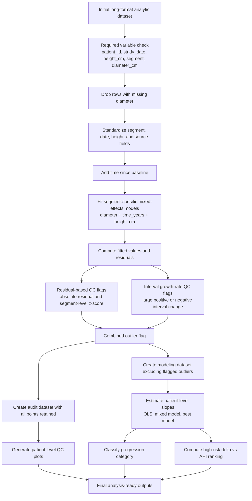

# Supplemental QC flow diagram

```mermaid
flowchart TD
    A[Initial long-format analytic dataset] --> B[Required variable check\npatient_id, study_date, height_cm, segment, diameter_cm]
    B --> C[Drop rows with missing diameter]
    C --> D[Standardize segment, date, height, and source fields]
    D --> E[Add time since baseline]
    E --> F[Fit segment-specific mixed-effects models\ndiameter ~ time_years + height_cm]
    F --> G[Compute fitted values and residuals]
    G --> H[Residual-based QC flags\nabsolute residual and segment-level z-score]
    G --> I[Interval growth-rate QC flags\nlarge positive or negative interval change]
    H --> J[Combined outlier flag]
    I --> J
    J --> K[Create audit dataset with all points retained]
    J --> L[Create modeling dataset excluding flagged outliers]
    L --> M[Estimate patient-level slopes\nOLS, mixed model, best model]
    M --> N[Classify progression category]
    K --> O[Generate patient-level QC plots]
    M --> P[Compute high-risk delta vs AHI ranking]
    N --> Q[Final analysis-ready outputs]
    O --> Q
    P --> Q
```
